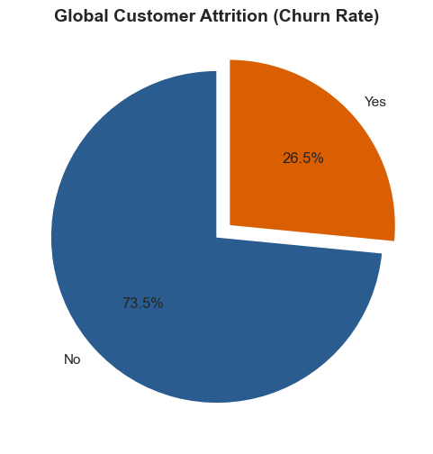
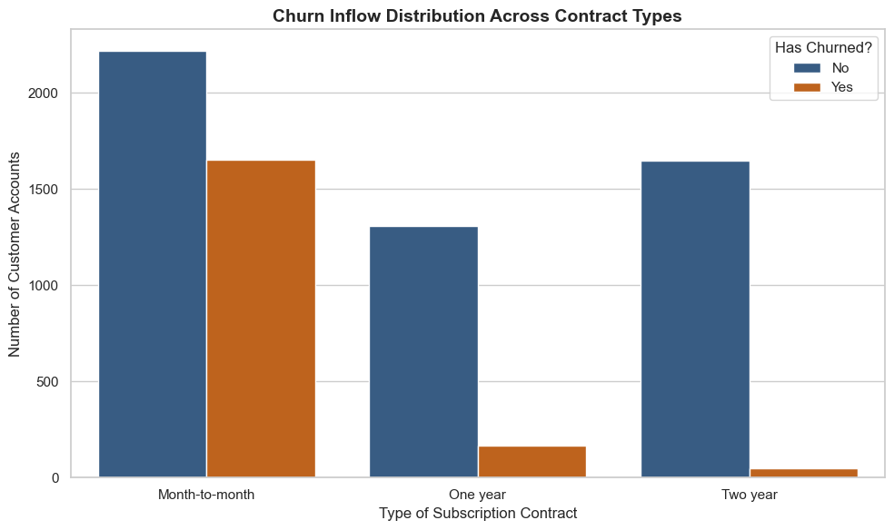
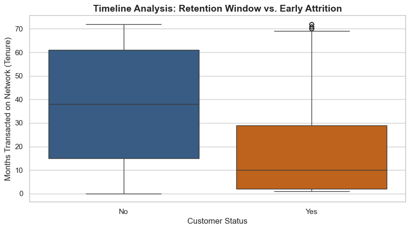

# Telecom Customer Retention & Churn Analytics

##  Business Overview & Problem Statement
A major telecommunications provider is experiencing a high rate of customer attrition, resulting in significant revenue leakage. In the subscription-based telecom industry, the Customer Acquisition Cost (CAC) is exceptionally high, making customer retention far more profitable than aggressive user acquisition. 

The objective of this project is to perform a data-driven diagnostic analysis using **Python (Pandas, Seaborn, Matplotlib)** to decode the behavioral patterns of churning customers, isolate the primary drivers of attrition, and deliver actionable strategic recommendations to maximize Customer Lifetime Value (LTV).

---

##  Executive Summary of Key Insights
The data "interview" revealed critical structural issues within the client's current pricing and contract distribution models:

* **The Critical 12-Month Retention Window:** Retained customers exhibit a stable median tenure of **38 months**, whereas churning customers have a median tenure of just **10 months**. Attrition is heavily concentrated within the early onboarding phase (the first year).
* **The Price-Sensitivity Alarm:** The median monthly charges for churned customers (**$79.65**) are significantly higher than those of active, retained accounts (**$64.43**). The client is aggressively driving away its highest-paying premium customers.
* **The Financial Leakage:** By aggregating the monthly charges of lost accounts, the analysis quantifies the exact total monthly revenue currently at risk, providing a clear financial justification for targeted retention campaigns.

---

## Tech Stack & Methods Used
* **Data Manipulation:** Python `pandas` (Grouping, aggregations, data profiling, type-casting)
* **Data Visualization:** `seaborn`, `matplotlib` (Distribution plots, proportional matrices, visual storytelling)
* **Analytical Frameworks:** Cohort Analysis, Categorical Profiling, Feature-Threshold Mapping

---

## Detailed Exploratory Data Analysis (EDA)

### 1. Numerical Portfolio Diagnostics
The continuous numerical features were aggregated and segmented by customer status (`Churn` vs `No Churn`) to isolate shifts in behavioral patterns:

| Customer Status | Mean Tenure (Months) | Median Tenure (Months) | Mean Monthly Charges | Median Monthly Charges |
| :--- | :--- | :--- | :--- | :--- |
| **Active (Retained)** | 37.56 Months | 38.0 Months | $61.27 | $64.43 |
| **Churned (Lost)** | 17.98 Months | **10.0 Months** | $74.44 | **$79.65** |

### 2. Categorical Vulnerabilities (Key Visual Insights)
Through categorical distribution plots, several core operational patterns emerged:
* **Contract Type Cohorts:** Month-to-month subscribers display a drastically higher churn rate compared to users secured by 1-year or 2-year agreements. 
* **Service Quality Overpricing:** High-spending customer brackets show an increased propensity to switch networks, signaling potential service delivery gaps or stability issues relative to competitor introductory pricing.

---
---

### 2. Visual Data Storytelling & Cohort Diagnostics

#### Chart 1: Global Customer Attrition (The Macro Problem)
This visual measures the complete volume of revenue-generating accounts the business has lost, setting a clear baseline metric for our financial exposure.

#### Chart 2: Churn Inflow Across Subscription Types (The Structural Weakness)
By segmenting users into their respective contract frameworks, the plot reveals an extreme churn concentration in month-to-month contracts, proving short-term billing models are driving the attrition.

#### Chart 3: Timeline Distribution Analysis (The Critical Drop-Off Window)
This boxplot clearly contrasts the lifecycle of a loyal customer versus a lost customer. It visually documents that the primary risk window is concentrated heavily within the first 10 months of onboarding.

## Strategic Business Recommendations

Based on the quantitative insights extracted during this project, the following three consulting interventions have been formulated for executive leadership:

### 1. Launch a "First-Year Loyalty" Pricing Architecture
* **Data Justification:** Churned users display a median tenure of just 10 months while bearing premium rates ($79.65/mo).
* **Action Plan:** Implement an automated milestone mechanism. When high-tier accounts cross their 6th month of active tenure, apply a selective 10% loyalty discount or streaming bundle credit to incentivize them past the critical 12-month attrition hurdle.

### 2. Establish an Account Migration Campaign for Month-to-Month Users
* **Data Justification:** Month-to-month contracts serve as the primary pipeline fuel for overall attrition.
* **Action Plan:** Offer month-to-month users a one-time statement incentive (e.g., $30 credit) if they transition to a locked 1-Year agreement. The upfront incentive cost is completely neutralized by stabilizing and securing their long-term contract value.

### 3. Conduct a Premium Service Quality Infrastructure Audit
* **Data Justification:** High-paying consumers are departing at a faster rate than low-tier budget users.
* **Action Plan:** Direct the engineering team to audit high-speed data stability (specifically Fiber Optic lines). High-paying customers expect premium network uptime; if technical micro-outages are frequent, technical frustration not just price is driving the attrition.
